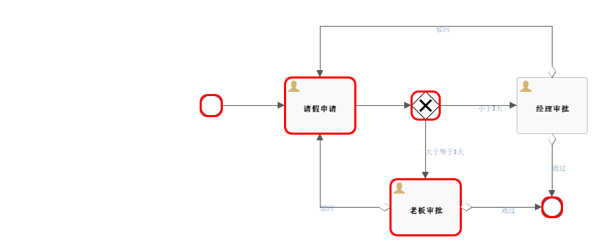

### workflow-server
工作流服务，集成[FlowAble v6.4.2](https://www.flowable.org)工作流引擎，详情请看[参考文档](https://www.flowable.org/docs/userguide/index.html)

##### 一、流程编辑器
- 1、请前往flowable[官网](https://www.flowable.org)或[GitHub](https://github.com/flowable/flowable-engine/releases)下载并部署 flowable-modeler 至 tomcat9 并启动
- 2、或者下载docker镜像 flowable/all-in-one 并启动
```
docker run -p8080:8080 flowable/all-in-one
```
- 3、浏览器打开网址 http://localhost:8080/flowable-modeler 
- 4、登录用户名及密码：admin/test
- 5、编辑好一个流程之后，导出为 xxxx.bpmn20.xml 文件

##### 二、流程部署
- 1、将生成的 xxxx.bpmn20.xml 流程定义文件放到 resources/processes 路径下即可，每次启动时系统会自动装载并部署 resources/processes 路径下的所有流程
- 2、流程更新重新部署后，只有新发起的流程会使用新流程，之前尚未结束的流程，仍然走老版本的流程
- 3、有许多配置参数可以灵活更改达到不同的效果，请[参考文档](https://www.flowable.org/docs/userguide/index.html)

##### 三、接口说明
- 1、工作流服务目前已封装如下5个接口，接口详情请在浏览器中访问 /swagger-ui.html 页面
    - 启动流程
    - 获取用户待办任务列表
    - 流程处理
    - 流程处理历史查询
    - 生成流程图
- 2、需动态配置路由策略。

##### 四、固定必要的流程变量
- businessKey - 业务键
- flowName - 流程名称
- title - 流程标题
- description - 流程描述
- startUserId - 业务键
- pass - 处理结果：true-通过，false-不通过
- comment - 处理意见

##### 五、流程示例
- 流程图：
